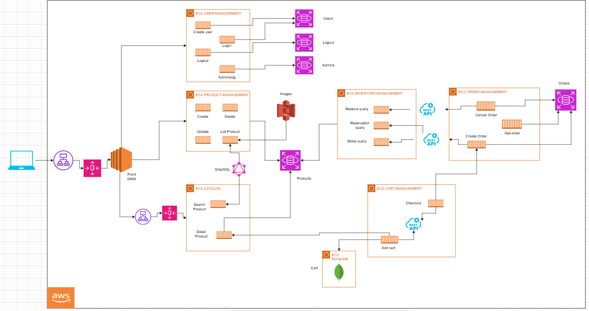

# 🛍️ Paper Chain Project



## 🌟 Overview
Paper Chain is a **highly scalable** and **distributed e-commerce system** designed for a stationery store. It is built using a **microservices architecture**, ensuring flexibility, scalability, and high availability. The project is fully deployed on **AWS** using services like **EC2, S3, RDS, MongoDB, Load Balancer, and Auto Scaling**.

---

## 🚀 Technologies Used

| **Category**        | **Technology**     |
|---------------------|-------------------|
| **Backend**        | Node.js, Python, Go, PHP (Lumen) |
| **Frontend**       | HTML, Nginx |
| **Database (SQL)** | PostgreSQL (AWS RDS) |
| **Database (NoSQL)** | MongoDB (EC2) |
| **Infrastructure**  | AWS EC2, S3, Load Balancer, Auto Scaling |
| **Containerization** | Docker, Docker Compose |

---

## 📂 Project Structure

The system is divided into multiple **domains**, each containing specific microservices:

### **1️⃣ User Management (Python - FastAPI)**
- 🛠️ `create-user-service` ➝ Handles new user registration.
- 🔑 `login-service` ➝ Manages user authentication.
- 🚪 `logout-service` ➝ Handles user logout.
- 🏢 `admin-login-service` ➝ Admin authentication system.

### **2️⃣ Products Management (Node.js - Express)**
- 📦 `create-product-service` ➝ Creates new products.
- 📋 `list-product-service` ➝ Lists available products.
- ✏️ `update-product-service` ➝ Updates product details.
- 🗑️ `delete-product-service` ➝ Deletes products.

### **3️⃣ Catalog (PHP - Lumen & Node.js)**
- 🔍 `search-product-service` ➝ Searches for products (Node.js).
- 📝 `detail-product-service` ➝ Fetches product details (PHP - Lumen).

### **4️⃣ Cart (Node.js - Express, MongoDB)**
- 🛒 `add-cart-service` ➝ Adds products to the cart.
- ✅ `checkout-service` ➝ Manages the checkout process.

### **5️⃣ Inventory (Go - GUI)**
- 📊 `check-query-service` ➝ Queries stock availability.
- 🔒 `reservation-query-service` ➝ Reserves stock for orders.
- 🔄 `update-query-service` ➝ Updates inventory after orders.

### **6️⃣ Orders (Node.js - Express, PostgreSQL)**
- 📝 `create-order-service` ➝ Creates customer orders.
- 📦 `get-order-service` ➝ Retrieves order details.
- ❌ `cancel-order-service` ➝ Cancels an order and restores stock.

### **7️⃣ Frontend (HTML + Nginx on EC2)**
A simple and efficient **static frontend** hosted on an **Nginx server in EC2**, allowing users to interact with the microservices.

### **8️⃣ Image Storage**
- 📷 **Images**: Stored in **AWS S3** for scalable product image management.
- ⚖️ **Load Balancing & Auto Scaling**:
  - Applied to the **catalog services** and **frontend** to ensure high availability and performance.

---

## 📦 Deployment
The project is fully containerized and deployed using **Docker & Docker Compose** on AWS EC2 instances. The microservices are structured into different instances and communicate efficiently via API calls.

### **Key AWS Services Used**:
- **EC2**: Hosts all microservices & frontend.
- **RDS (PostgreSQL)**: Stores structured data.
- **MongoDB on EC2**: Stores cart data.
- **S3**: Stores product images.
- **Load Balancer & Auto Scaling**: Ensures system reliability & performance.

---

## 🎯 Installation & Setup
### **Prerequisites**
- Docker & Docker Compose installed
- AWS EC2 instances configured
- PostgreSQL & MongoDB setup

### **Setup Instructions**
1. **Clone the repository:**
   ```bash
   git clone https://github.com/ciizao/Paper-chain-project.git
   cd Paper-chain-project
   ```
2. **Run Docker Compose:**
   ```bash
   docker-compose up -d
   ```
3. **Access the frontend:**
   - Open `http://<EC2_INSTANCE_IP>` in your browser.

---

## 📌 API Endpoints

### **User Management**
| Method | Endpoint | Description |
|--------|---------|-------------|
| POST | `/user/create` | Register a new user |
| POST | `/user/login` | Authenticate user |
| POST | `/user/logout` | Logout user |

### **Products Management**
| Method | Endpoint | Description |
|--------|---------|-------------|
| POST | `/product/create` | Create a new product |
| GET | `/product/list` | List all products |
| PUT | `/product/update/:id` | Update product details |
| DELETE | `/product/delete/:id` | Remove a product |

### **Orders**
| Method | Endpoint | Description |
|--------|---------|-------------|
| POST | `/order/create` | Place an order |
| GET | `/order/:id` | Fetch order details |
| PUT | `/order/cancel/:id` | Cancel an order |

For a full list of endpoints, check the **API documentation** inside the repository.

---

## 🛠️ Contributing
1. Fork the repository.
2. Create a new feature branch: `git checkout -b feature-name`
3. Commit your changes: `git commit -m "Added new feature"`
4. Push to the branch: `git push origin feature-name`
5. Create a Pull Request 🚀


